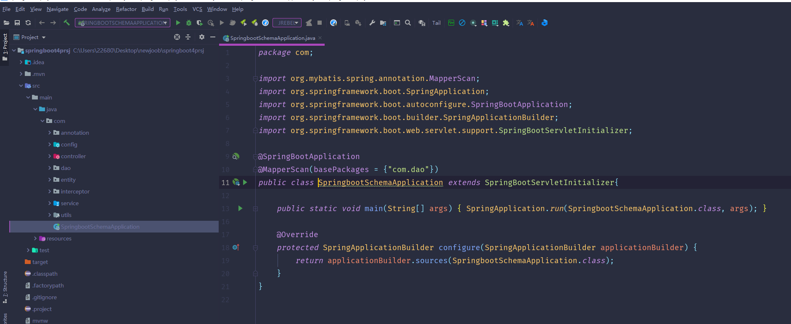
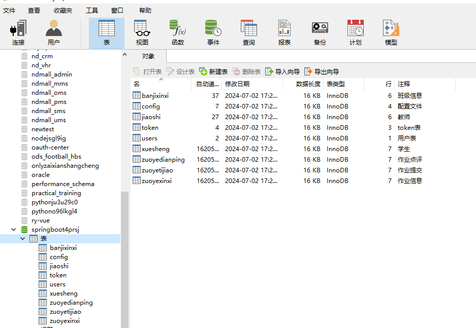
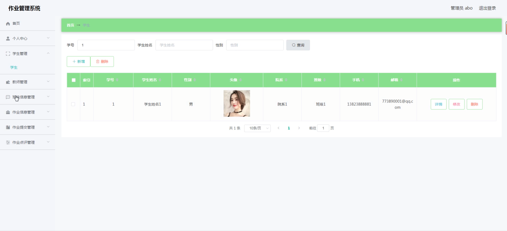
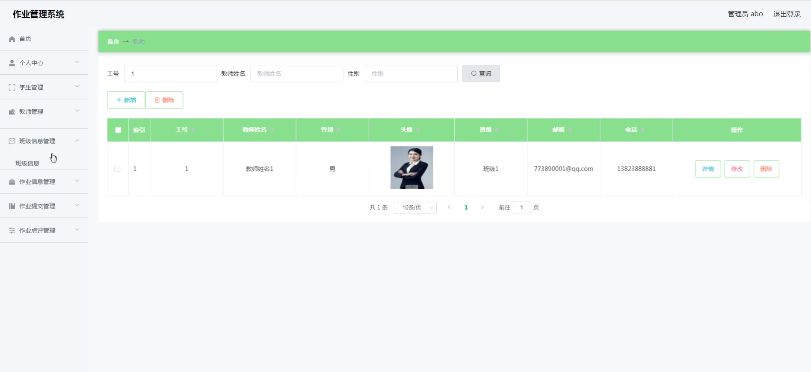
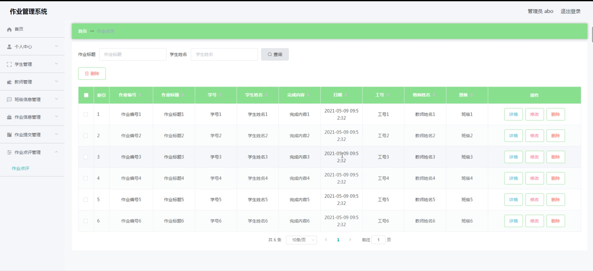
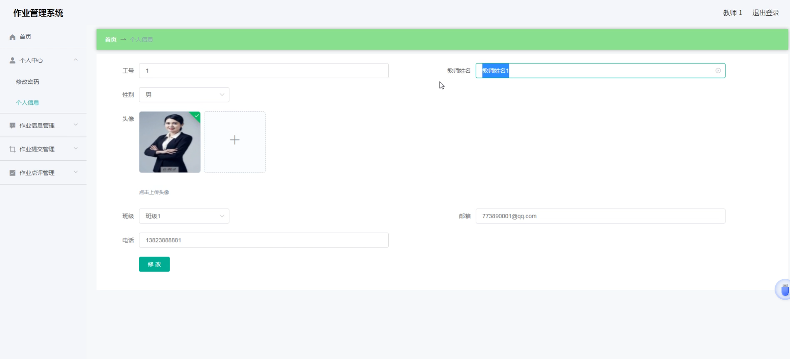
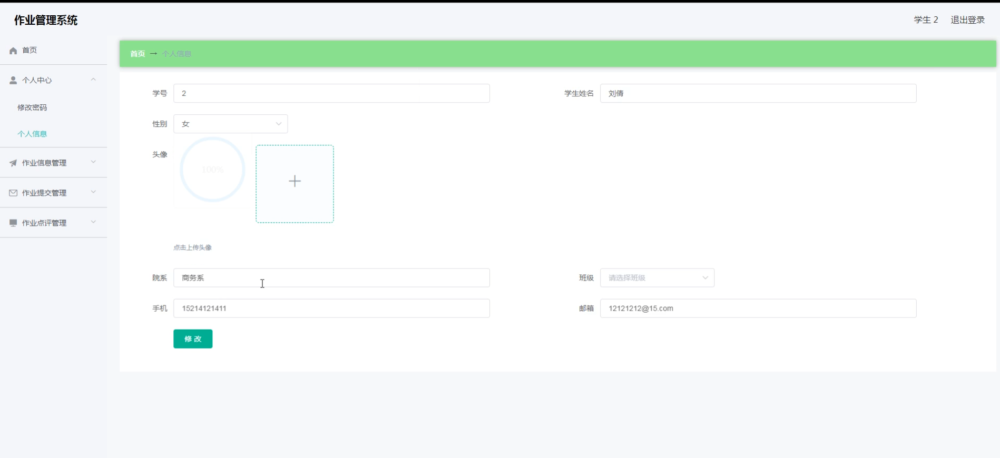
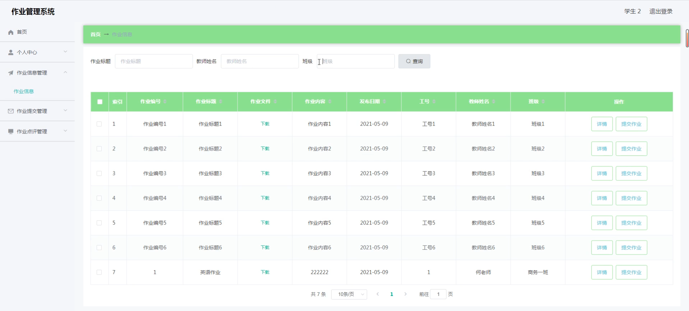
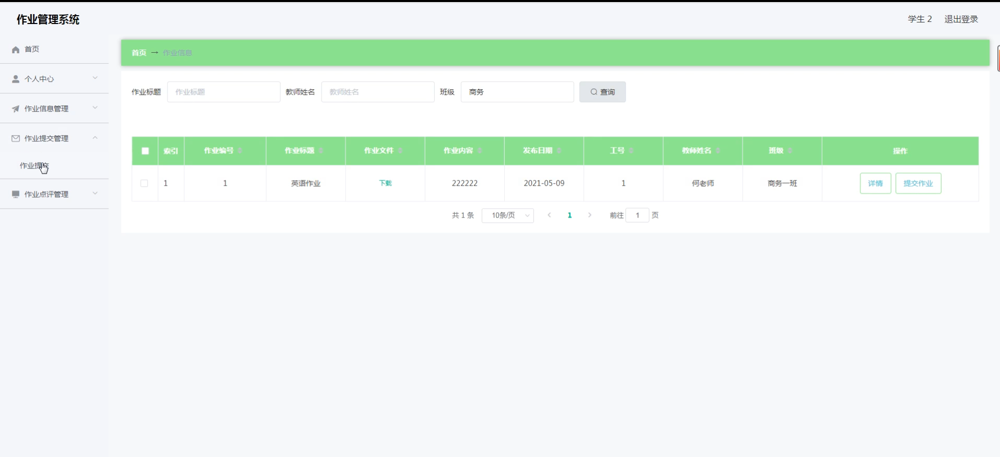
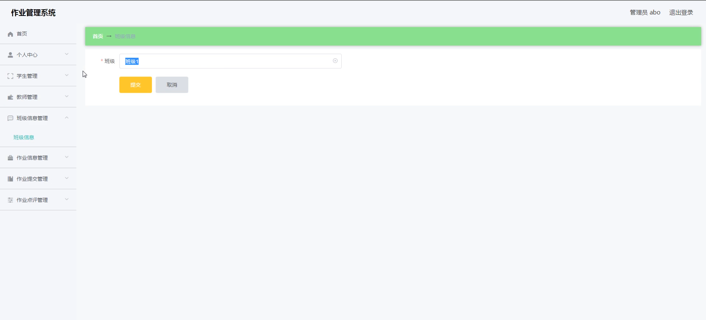

# 基于springboot的作业管理系统

#### 介绍

我开发的基于Spring Boot的作业管理系统旨在为学校、教师和学生提供一个高效的作业管理平台。系统采用Spring Boot框架，确保了系统的高性能和可扩展性，同时使用了现代的前端技术，以提供良好的用户体验。该系统拥有三个主要角色：管理端、教师端和学生端，每个角色具有特定的功能模块，以满足不同用户的需求。

#### 技术栈

后端技术栈：Springboot+Mysql+Maven

前端技术栈：Vue+Html+Css+Javascript+ElementUI

开发工具：Idea+Vscode+Navicate

#### 系统功能介绍

管理端功能模块  
个人中心：管理员可以在个人中心管理自己的个人信息，包括修改密码、更新联系方式等。  
学生管理：管理员可以添加、修改、删除学生信息，并分配学生到不同的班级中。  
教师管理：管理员可以管理教师信息，分配教师到不同的班级和课程。  
班级信息管理：管理员可以创建和管理班级信息，包括班级名称、年级、班主任等。  
作业信息管理：管理员可以查看和管理所有的作业信息，包括作业的标题、描述、截止日期等。  
作业提交管理：管理员可以查看所有学生的作业提交情况，统计提交的作业数量，查看未提交的学生名单等。  
作业点评管理：管理员可以查看教师对学生作业的点评，了解学生的学习情况和作业完成质量。  

教师端功能模块   
个人中心：教师可以在个人中心管理自己的个人信息，包括修改密码、更新联系方式等。  
作业信息管理：教师可以发布作业，设置作业的标题、描述、截止日期等，管理自己所发布的作业。  
作业提交管理：教师可以查看所授课程下学生的作业提交情况，下载学生提交的作业，查看未提交的学生名单。  
作业点评管理：教师可以对学生提交的作业进行点评，给出评分和反馈，帮助学生改进和提高。  

学生端功能模块  
个人中心：学生可以在个人中心管理自己的个人信息，包括修改密码、更新联系方式等。  
作业信息管理：学生可以查看教师发布的作业信息，了解作业的要求和截止日期。  
作业提交管理：学生可以在线提交作业，上传作业文件或填写作业内容，查看自己已提交的作业。  
作业点评管理：学生可以查看教师对自己作业的点评和评分，了解自己的作业完成情况和需要改进的地方。  

#### 系统作用

该作业管理系统旨在提高学校的作业管理效率，简化教师和学生之间的作业提交和反馈流程。具体作用包括：

提高管理效率：通过集中管理学生和教师的信息，以及班级和作业的管理，管理员可以更高效地组织和协调学校的各项作业任务。  
简化作业流程：教师可以方便地发布和管理作业，学生可以在线提交作业，减少了纸质作业的繁琐流程，提高了作业提交和批改的效率。  
增强互动和反馈：通过作业点评功能，教师可以及时给出作业反馈，学生可以根据反馈进行改进，促进师生之间的良性互动和交流。  
数据统计和分析：系统提供了对作业提交和点评的统计和分析功能，帮助学校和教师了解学生的学习情况，制定更加有效的教学策略。  

#### 系统功能截图

代码结构

数据库表

登录

管理员端学生管理

教师管理

作业点评管理

教师端个人信息

学生端个人信息

作业信息管理

作业提交管理

班级信息管理

#### 总结

基于Spring Boot的作业管理系统为学校、教师和学生提供了一个高效、便捷的作业管理平台。通过系统的各项功能模块，管理员可以有效地管理学生和教师的信息，教师可以简化作业的发布和批改流程，学生可以方便地提交和查看作业反馈。该系统不仅提高了作业管理的效率，还促进了师生之间的互动和反馈，为学校的教学管理提供了有力的支持。

#### 使用说明

创建数据库，执行数据库脚本 修改jdbc数据库连接参数 下载安装maven依赖jar 启动idea中的springboot项目

后台地址
http://localhost:8080/springboot4prsj/admin/dist/index.html

管理员  abo 密码 abo
